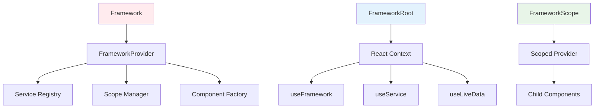
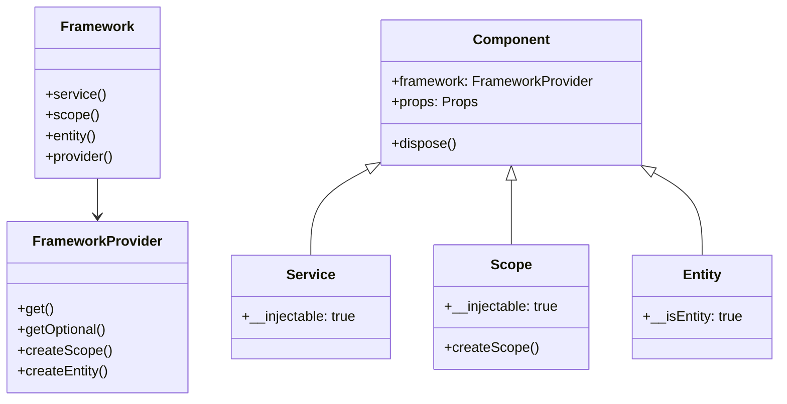
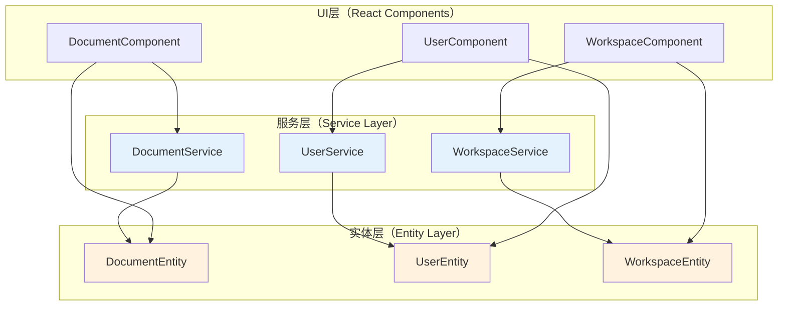

# AFFiNE 项目 Framework 框架完整技术文档

## 概述

AFFiNE Framework 是一个基于依赖注入（DI）和作用域管理的现代前端框架，专为大型 React 应用程序设计。它提供了强大的服务管理、作用域隔离、响应式数据绑定和 React 深度集成能力，是 AFFiNE 项目的核心架构基础。

## 核心概念

### 1. 依赖注入 (Dependency Injection)

依赖注入是一种设计模式，通过外部容器管理对象的创建和依赖关系，实现松耦合的架构设计。

```typescript
// ❌ 传统方式：硬编码依赖
class UserService {
  constructor() {
    this.database = new Database(); // 硬编码依赖
  }
}

// ✅ 依赖注入：从外部注入依赖
class UserService {
  constructor(private database: Database) {
    // 依赖通过构造函数注入
  }
}
```

### 2. 作用域管理 (Scope Management)

作用域定义了服务实例的生命周期和可见性范围，支持层级嵌套和隔离。

```typescript
// 定义作用域
class WorkspaceScope extends Scope<{ workspaceId: string }> {}
class PageScope extends Scope<{ pageId: string }> {}

// 作用域层次结构
// Root Scope
//   └── Workspace Scope (workspaceId: "ws-1")
//       ├── Page Scope (pageId: "page-1")
//       └── Page Scope (pageId: "page-2")
```

### 3. 响应式数据 (Reactive Data)

基于 RxJS 的响应式数据系统，支持数据变化的自动通知和 React 组件的自动更新。

```typescript
// 创建响应式数据
const count$ = new LiveData(0);

// 在 React 组件中使用
function Counter() {
  const count = useLiveData(count$);
  return <div>{count}</div>;
}
```

#### LiveData 详解

**LiveData** 是 AFFiNE Framework 中的核心响应式数据类，它继承自 RxJS 的 Observable，专门为 React 应用设计，提供了高效的状态管理和自动 UI 更新能力。

##### LiveData 的核心特性

1. **响应式更新**：数据变化时自动通知所有订阅者
2. **React 集成**：与 React 的 `useSyncExternalStore` 深度集成
3. **类型安全**：完整的 TypeScript 类型支持
4. **内存高效**：智能的订阅管理，避免内存泄漏
5. **函数式操作**：支持 map、filter、combine 等操作符

##### LiveData 基本用法

```typescript
import { LiveData } from '@toeverything/infra';

// 1. 创建 LiveData
const counter$ = new LiveData(0);
const message$ = new LiveData<string>('Hello');
const user$ = new LiveData<User | null>(null);

// 2. 读取当前值
console.log(counter$.value); // 0

// 3. 更新值
counter$.next(1);
message$.next('World');
user$.next({ id: '1', name: 'Alice' });

// 4. 订阅变化（非 React 环境）
const subscription = counter$.subscribe(value => {
  console.log('Counter changed:', value);
});

// 5. 取消订阅
subscription.unsubscribe();
```

##### LiveData 操作符

```typescript
// map: 转换数据
const doubled$ = counter$.map(value => value * 2);
const upperMessage$ = message$.map(msg => msg.toUpperCase());

// filter: 过滤数据
const evenNumbers$ = counter$.filter(value => value % 2 === 0);
const nonEmptyMessage$ = message$.filter(msg => msg.length > 0);

// combine: 组合多个 LiveData
const combined$ = LiveData.combine([counter$, message$], (count, msg) => `${msg}: ${count}`);

// from: 从其他数据源创建
const fromPromise$ = LiveData.from(
  fetch('/api/data').then(res => res.json()),
  'loading' // 初始值
);

// distinctUntilChanged: 去重
const distinct$ = counter$.distinctUntilChanged();
```

##### LiveData 在服务中的使用

```typescript
class UserService extends Service {
  // 用户状态
  readonly currentUser$ = new LiveData<User | null>(null);
  readonly isLoading$ = new LiveData<boolean>(false);
  readonly error$ = new LiveData<string | null>(null);

  // 计算属性
  readonly isLoggedIn$ = this.currentUser$.map(user => user !== null);
  readonly userName$ = this.currentUser$.map(user => user?.name ?? 'Guest');

  constructor(private authService: AuthService) {
    super();
    this.initializeUser();
  }

  private async initializeUser() {
    this.isLoading$.next(true);
    this.error$.next(null);

    try {
      const user = await this.authService.getCurrentUser();
      this.currentUser$.next(user);
    } catch (error) {
      this.error$.next(error.message);
    } finally {
      this.isLoading$.next(false);
    }
  }

  async login(email: string, password: string) {
    this.isLoading$.next(true);
    this.error$.next(null);

    try {
      const user = await this.authService.login(email, password);
      this.currentUser$.next(user);
    } catch (error) {
      this.error$.next(error.message);
    } finally {
      this.isLoading$.next(false);
    }
  }

  logout() {
    this.currentUser$.next(null);
    this.authService.logout();
  }
}
```

#### useLiveData Hook 详解

**useLiveData** 是专门用于在 React 组件中订阅 LiveData 的 Hook，它基于 React 18 的 `useSyncExternalStore` 实现，提供了高效且安全的状态订阅机制。

##### useLiveData 的核心特性

1. **自动订阅**：组件挂载时自动订阅，卸载时自动取消订阅
2. **性能优化**：只有当数据真正变化时才触发重新渲染
3. **类型安全**：完整保留 LiveData 的类型信息
4. **并发安全**：支持 React 18 的并发特性
5. **空值处理**：优雅处理 null 和 undefined 的 LiveData

##### useLiveData 基本用法

```typescript
import { useLiveData, useService } from '@toeverything/infra/react';

// 1. 基本使用
function UserProfile() {
  const userService = useService(UserService);

  // 订阅用户数据
  const currentUser = useLiveData(userService.currentUser$);
  const isLoading = useLiveData(userService.isLoading$);
  const error = useLiveData(userService.error$);

  // 订阅计算属性
  const isLoggedIn = useLiveData(userService.isLoggedIn$);
  const userName = useLiveData(userService.userName$);

  if (isLoading) {
    return <div>Loading...</div>;
  }

  if (error) {
    return <div>Error: {error}</div>;
  }

  return (
    <div>
      <h1>Welcome, {userName}!</h1>
      {isLoggedIn ? (
        <div>
          <p>User ID: {currentUser?.id}</p>
          <button onClick={() => userService.logout()}>
            Logout
          </button>
        </div>
      ) : (
        <LoginForm onLogin={userService.login} />
      )}
    </div>
  );
}
```

##### useLiveData 高级用法

```typescript
// 1. 条件订阅
function DocumentEditor({ documentId }: { documentId?: string }) {
  const docService = useService(DocumentService);

  // 只有当 documentId 存在时才订阅
  const document = useLiveData(
    documentId ? docService.getDocument$(documentId) : null
  );

  // document 的类型是 Document | null | undefined
  if (!documentId) {
    return <div>No document selected</div>;
  }

  if (!document) {
    return <div>Loading document...</div>;
  }

  return <div>{document.title}</div>;
}

// 2. 组合多个 LiveData
function Dashboard() {
  const userService = useService(UserService);
  const docService = useService(DocumentService);

  const user = useLiveData(userService.currentUser$);
  const documents = useLiveData(docService.documents$);
  const recentDocs = useLiveData(docService.recentDocuments$);

  // 使用 useMemo 创建组合数据
  const dashboardData = useMemo(() => {
    return {
      user,
      totalDocs: documents.length,
      recentDocs: recentDocs.slice(0, 5)
    };
  }, [user, documents, recentDocs]);

  return (
    <div>
      <h1>Dashboard for {dashboardData.user?.name}</h1>
      <p>Total documents: {dashboardData.totalDocs}</p>
      <RecentDocuments docs={dashboardData.recentDocs} />
    </div>
  );
}

// 3. 自定义 Hook 封装
function useCurrentUser() {
  const userService = useService(UserService);

  const currentUser = useLiveData(userService.currentUser$);
  const isLoading = useLiveData(userService.isLoading$);
  const error = useLiveData(userService.error$);
  const isLoggedIn = useLiveData(userService.isLoggedIn$);

  return {
    user: currentUser,
    isLoading,
    error,
    isLoggedIn,
    login: userService.login.bind(userService),
    logout: userService.logout.bind(userService)
  };
}

// 使用自定义 Hook
function Header() {
  const { user, isLoggedIn, logout } = useCurrentUser();

  return (
    <header>
      {isLoggedIn ? (
        <div>
          <span>Hello, {user?.name}</span>
          <button onClick={logout}>Logout</button>
        </div>
      ) : (
        <LoginButton />
      )}
    </header>
  );
}
```

##### 性能优化最佳实践

```typescript
// 1. 避免在渲染函数中创建 LiveData
function BadExample() {
  const userService = useService(UserService);

  // ❌ 错误：每次渲染都会创建新的 LiveData
  const filteredUsers = useLiveData(
    userService.users$.map(users => users.filter(u => u.active))
  );

  return <div>{filteredUsers.length}</div>;
}

function GoodExample() {
  const userService = useService(UserService);

  // ✅ 正确：在服务中预定义计算属性
  const activeUsers = useLiveData(userService.activeUsers$);

  return <div>{activeUsers.length}</div>;
}

// 2. 使用 useMemo 缓存计算结果
function OptimizedComponent() {
  const docService = useService(DocumentService);
  const documents = useLiveData(docService.documents$);

  // 使用 useMemo 缓存昂贵的计算
  const sortedDocs = useMemo(() => {
    return documents
      .sort((a, b) => b.lastModified.getTime() - a.lastModified.getTime())
      .slice(0, 10);
  }, [documents]);

  return (
    <div>
      {sortedDocs.map(doc => (
        <DocumentItem key={doc.id} document={doc} />
      ))}
    </div>
  );
}

// 3. 条件渲染优化
function ConditionalRendering() {
  const userService = useService(UserService);
  const isLoggedIn = useLiveData(userService.isLoggedIn$);

  // 只有在需要时才订阅用户数据
  if (!isLoggedIn) {
    return <LoginForm />;
  }

  return <UserDashboard />;
}

function UserDashboard() {
  const userService = useService(UserService);
  const user = useLiveData(userService.currentUser$); // 只有登录后才订阅

  return <div>Welcome, {user?.name}!</div>;
}
```

##### 错误处理和调试

```typescript
// 1. 错误边界处理
function SafeComponent() {
  const userService = useService(UserService);

  try {
    const user = useLiveData(userService.currentUser$);
    const error = useLiveData(userService.error$);

    if (error) {
      return <ErrorDisplay error={error} />;
    }

    return <UserProfile user={user} />;
  } catch (error) {
    console.error('LiveData subscription error:', error);
    return <div>Something went wrong</div>;
  }
}

// 2. 开发环境调试
function DebugComponent() {
  const userService = useService(UserService);
  const user = useLiveData(userService.currentUser$);

  // 开发环境下的调试信息
  useEffect(() => {
    if (process.env.NODE_ENV === 'development') {
      console.log('User changed:', user);
    }
  }, [user]);

  return <div>{user?.name}</div>;
}

// 3. LiveData 状态监控
function useDebugLiveData<T>(liveData: LiveData<T>, name: string) {
  const value = useLiveData(liveData);

  useEffect(() => {
    if (process.env.NODE_ENV === 'development') {
      console.log(`[${name}] LiveData changed:`, value);
    }
  }, [value, name]);

  return value;
}

// 使用调试 Hook
function MonitoredComponent() {
  const userService = useService(UserService);
  const user = useDebugLiveData(userService.currentUser$, 'currentUser');

  return <div>{user?.name}</div>;
}
```

## 框架架构

### 整体架构图



### 核心组件关系



## 核心概念深度解析

### 什么是作用域（Scope）？

**作用域**是 AFFiNE Framework 中用于管理服务实例生命周期和可见性范围的核心概念。它类似于编程语言中的作用域概念，但专门用于依赖注入容器的管理。

#### 作用域的作用

1. **生命周期管理**：控制服务实例的创建、存活和销毁时机
2. **资源隔离**：不同作用域中的服务实例相互独立，避免数据污染
3. **内存管理**：当作用域销毁时，自动清理其中的所有服务实例
4. **业务边界**：为不同的业务场景提供独立的服务容器

#### 作用域的层级结构

```
Root Scope (应用级别)
├── Workspace Scope (工作空间级别)
│   ├── Page Scope (页面级别)
│   │   ├── Editor Scope (编辑器级别)
│   │   └── Comment Scope (评论级别)
│   └── Settings Scope (设置级别)
└── User Scope (用户级别)
```

#### 实际应用场景

```typescript
// 工作空间作用域：每个工作空间有独立的文档管理服务
class WorkspaceScope extends Scope<{ workspaceId: string }> {
  // 工作空间特定的配置和服务
}

// 页面作用域：每个页面有独立的编辑状态
class PageScope extends Scope<{ pageId: string }> {
  // 页面特定的编辑器状态和服务
}

// 使用示例
function WorkspacePage({ workspaceId }: { workspaceId: string }) {
  return (
    <FrameworkScope scope={WorkspaceScope} props={{ workspaceId }}>
      <DocumentList /> {/* 这里的服务都是工作空间级别的 */}
    </FrameworkScope>
  );
}
```

### 什么是服务（Service）？

**服务**是框架中承载业务逻辑的核心组件，它们是可复用的、有状态的业务对象，通过依赖注入进行管理。

#### 服务的作用

1. **业务逻辑封装**：将相关的业务功能组织在一起
2. **状态管理**：维护应用的业务状态和数据
3. **跨组件共享**：多个 React 组件可以共享同一个服务实例
4. **依赖管理**：自动处理服务之间的依赖关系

#### 服务的特点

```typescript
// 文档管理服务示例
class DocumentService extends Service {
  // 响应式数据
  documents$ = new LiveData<Document[]>([]);
  currentDocument$ = new LiveData<Document | null>(null);

  constructor(
    private storage: StorageService, // 依赖注入
    private sync: SyncService // 依赖注入
  ) {
    super();
  }

  // 业务方法
  async createDocument(title: string): Promise<Document> {
    const doc = new Document({ title });
    await this.storage.save(doc);
    this.documents$.next([...this.documents$.value, doc]);
    return doc;
  }

  async deleteDocument(id: string): Promise<void> {
    await this.storage.delete(id);
    const docs = this.documents$.value.filter(d => d.id !== id);
    this.documents$.next(docs);
  }
}
```

#### 服务的使用

```typescript
// 在 React 组件中使用服务
function DocumentList() {
  const docService = useService(DocumentService);
  const documents = useLiveData(docService.documents$);

  const handleCreate = () => {
    docService.createDocument('新文档');
  };

  return (
    <div>
      {documents.map(doc => (
        <div key={doc.id}>{doc.title}</div>
      ))}
      <button onClick={handleCreate}>创建文档</button>
    </div>
  );
}
```

### 什么是注册（Registration）？

**注册**是将服务、作用域或实体类型告知框架容器的过程，让框架知道如何创建和管理这些组件。

#### 注册的作用

1. **类型声明**：告诉框架有哪些可用的服务类型
2. **依赖配置**：指定服务的依赖关系
3. **生命周期配置**：设置服务的创建和销毁规则
4. **工厂配置**：自定义服务的创建逻辑

#### 注册的方式

```typescript
// 1. 简单服务注册
framework.service(DocumentService);

// 2. 带依赖的服务注册
framework.service(DocumentService, [
  StorageService, // 第一个依赖
  SyncService, // 第二个依赖
]);

// 3. 作用域注册
framework.scope(WorkspaceScope);

// 4. 实体注册
framework.entity(DocumentEntity, [DocumentService]);

// 5. 模块化注册
function configureDocumentModule(framework: Framework) {
  framework.service(StorageService).service(SyncService).service(DocumentService, [StorageService, SyncService]).scope(WorkspaceScope).entity(DocumentEntity, [DocumentService]);
}
```

### Component 基类的作用

**Component 基类**是所有框架组件（Service、Scope、Entity）的共同基础，提供了框架集成的核心能力。

#### Component 基类的职责

1. **框架访问**：提供对 FrameworkProvider 的访问
2. **属性注入**：自动注入组件的初始化属性
3. **生命周期管理**：提供资源清理机制
4. **上下文获取**：从构造上下文获取必要信息

```typescript
class Component<Props = {}> {
  readonly framework: FrameworkProvider; // 框架实例访问
  readonly props: Props; // 组件属性
  protected readonly disposables: (() => void)[] = []; // 资源清理列表

  constructor() {
    // 自动从构造上下文获取框架和属性
    this.framework = CONSTRUCTOR_CONTEXT.current.provider;
    this.props = CONSTRUCTOR_CONTEXT.current.props;
  }

  // 资源清理方法
  dispose() {
    this.disposables.forEach(dispose => dispose());
  }

  // 添加需要清理的资源
  protected addDisposable(disposable: () => void) {
    this.disposables.push(disposable);
  }
}
```

### Service 类的特殊性

**Service 类**继承自 Component，专门用于承载业务逻辑，具有以下特点：

1. **可注入标识**：`__injectable = true` 标识可以被依赖注入
2. **业务逻辑载体**：承载具体的业务功能实现
3. **状态管理**：通常包含响应式数据（LiveData）
4. **跨组件共享**：可以在多个 React 组件间共享

```typescript
class UserService extends Service {
  readonly __injectable = true;

  // 用户状态
  currentUser$ = new LiveData<User | null>(null);
  isLoggedIn$ = this.currentUser$.map(user => user !== null);

  constructor(
    private authService: AuthService,
    private storageService: StorageService
  ) {
    super();
    this.initializeUser();
  }

  private async initializeUser() {
    const token = await this.storageService.getToken();
    if (token) {
      const user = await this.authService.validateToken(token);
      this.currentUser$.next(user);
    }
  }

  async login(email: string, password: string) {
    const user = await this.authService.login(email, password);
    this.currentUser$.next(user);
    await this.storageService.saveToken(user.token);
  }

  async logout() {
    await this.storageService.clearToken();
    this.currentUser$.next(null);
  }
}
```

### Scope 类的特殊性

**Scope 类**继承自 Component，专门用于创建作用域边界：

1. **作用域标识**：`__injectable = true` 标识可以被注入
2. **子作用域创建**：可以创建嵌套的子作用域
3. **资源隔离**：提供独立的服务容器
4. **生命周期管理**：管理作用域内所有服务的生命周期

```typescript
class WorkspaceScope extends Scope<{ workspaceId: string }> {
  readonly __injectable = true;

  get workspaceId() {
    return this.props.workspaceId;
  }

  // 可以在作用域中添加特定的初始化逻辑
  constructor() {
    super();
    console.log(`创建工作空间作用域: ${this.workspaceId}`);
  }

  override dispose(): void {
    console.log(`销毁工作空间作用域: ${this.workspaceId}`);
    super.dispose(); // 清理整个作用域
  }
}
```

### Entity 类的特殊性

**Entity 类**继承自 Component，专门用于表示领域实体：

1. **实体标识**：`__isEntity = true` 标识这是一个实体
2. **领域对象**：表示业务领域中的核心概念
3. **有状态对象**：通常包含业务数据和行为
4. **短生命周期**：通常按需创建，不会长期缓存

```typescript
class DocumentEntity extends Entity<{ documentId: string }> {
  readonly __isEntity = true;

  // 文档数据
  content$ = new LiveData<string>('');
  title$ = new LiveData<string>('');
  lastModified$ = new LiveData<Date>(new Date());

  constructor(
    private documentService: DocumentService,
    private syncService: SyncService
  ) {
    super();
    this.loadDocument();
  }

  get documentId() {
    return this.props.documentId;
  }

  private async loadDocument() {
    const doc = await this.documentService.getDocument(this.documentId);
    this.content$.next(doc.content);
    this.title$.next(doc.title);
    this.lastModified$.next(doc.lastModified);
  }

  async updateContent(content: string) {
    this.content$.next(content);
    this.lastModified$.next(new Date());
    await this.syncService.syncDocument(this.documentId, content);
  }

  async updateTitle(title: string) {
    this.title$.next(title);
    this.lastModified$.next(new Date());
    await this.syncService.syncDocumentTitle(this.documentId, title);
  }
}
```

### 组件类型对比总结

| 组件类型      | 主要用途             | 生命周期             | 实例化方式     | 典型用例                     |
| ------------- | -------------------- | -------------------- | -------------- | ---------------------------- |
| **Service**   | 业务逻辑和状态管理   | 长期存在，作用域级别 | 依赖注入，单例 | UserService, DocumentService |
| **Scope**     | 作用域边界和资源隔离 | 与作用域同步         | 手动创建       | WorkspaceScope, PageScope    |
| **Entity**    | 领域对象和业务实体   | 短期存在，按需创建   | 工厂创建       | DocumentEntity, UserEntity   |
| **Component** | 基础能力提供         | 由子类决定           | 抽象基类       | 不直接使用                   |

## 实体（Entity）深度解析

### 什么是实体（Entity）？

**实体（Entity）**是 AFFiNE Framework 中用于表示业务领域对象的核心概念。它们代表了应用程序中具有唯一标识和业务意义的对象，如文档、用户、工作空间等。实体不仅包含数据，还包含与该数据相关的业务行为和规则。

#### 实体的核心特征

1. **唯一标识性**：每个实体都有唯一的标识符（如 ID）
2. **业务语义**：代表现实世界中的业务概念
3. **状态封装**：包含自己的数据状态和行为
4. **生命周期管理**：有明确的创建、更新、销毁生命周期
5. **响应式数据**：支持数据变化的自动通知

#### 实体的设计原则

```typescript
// 实体设计示例：文档实体
class DocumentEntity extends Entity<{ documentId: string }> {
  readonly __isEntity = true;

  // 1. 唯一标识
  get documentId() {
    return this.props.documentId;
  }

  // 2. 业务数据（响应式）
  title$ = new LiveData<string>('');
  content$ = new LiveData<string>('');
  lastModified$ = new LiveData<Date>(new Date());
  isPublished$ = new LiveData<boolean>(false);

  // 3. 计算属性
  wordCount$ = this.content$.map(content => content.split(' ').length);
  isEmpty$ = this.content$.map(content => content.trim().length === 0);

  constructor(
    private documentService: DocumentService,
    private syncService: SyncService,
    private permissionService: PermissionService
  ) {
    super();
    this.loadDocument();
  }

  // 4. 业务行为
  async updateTitle(newTitle: string): Promise<void> {
    if (!newTitle.trim()) {
      throw new Error('标题不能为空');
    }

    this.title$.next(newTitle);
    this.lastModified$.next(new Date());

    await this.syncService.syncDocumentTitle(this.documentId, newTitle);
  }

  async updateContent(newContent: string): Promise<void> {
    this.content$.next(newContent);
    this.lastModified$.next(new Date());

    await this.syncService.syncDocumentContent(this.documentId, newContent);
  }

  async publish(): Promise<void> {
    const hasPermission = await this.permissionService.canPublish(this.documentId);
    if (!hasPermission) {
      throw new Error('没有发布权限');
    }

    this.isPublished$.next(true);
    await this.documentService.publishDocument(this.documentId);
  }

  // 5. 生命周期管理
  private async loadDocument(): Promise<void> {
    const doc = await this.documentService.getDocument(this.documentId);
    this.title$.next(doc.title);
    this.content$.next(doc.content);
    this.lastModified$.next(doc.lastModified);
    this.isPublished$.next(doc.isPublished);
  }

  override dispose(): void {
    // 清理资源
    super.dispose();
  }
}
```

### 实体与服务的核心区别

#### 1. **概念层面的区别**

| 维度         | 实体（Entity）   | 服务（Service）  |
| ------------ | ---------------- | ---------------- |
| **概念定位** | 业务领域对象     | 业务逻辑处理器   |
| **代表什么** | "是什么"（名词） | "做什么"（动词） |
| **业务语义** | 具体的业务概念   | 抽象的业务能力   |
| **关注点**   | 数据状态和行为   | 业务流程和逻辑   |

#### 2. **生命周期的区别**

```typescript
// 服务：长生命周期，作用域级别的单例
class DocumentService extends Service {
  // 在整个作用域内只有一个实例
  // 生命周期与作用域同步
  documents$ = new LiveData<Document[]>([]);

  async createDocument(title: string): Promise<DocumentEntity> {
    // 创建新的文档实体
    const entity = this.framework.createEntity(DocumentEntity, {
      documentId: generateId(),
    });
    return entity;
  }
}

// 实体：短生命周期，按需创建
class DocumentEntity extends Entity<{ documentId: string }> {
  // 每个文档都有独立的实体实例
  // 生命周期与具体业务对象绑定
  constructor() {
    super();
    // 实体可能在用户关闭文档时被销毁
  }
}
```

#### 3. **职责分工的区别**

```typescript
// 服务：负责管理多个实体，提供业务能力
class DocumentService extends Service {
  // 管理所有文档
  allDocuments$ = new LiveData<DocumentEntity[]>([]);

  // 提供文档相关的业务能力
  async createDocument(title: string): Promise<DocumentEntity> {
    /* ... */
  }
  async deleteDocument(id: string): Promise<void> {
    /* ... */
  }
  async searchDocuments(query: string): Promise<DocumentEntity[]> {
    /* ... */
  }
  async importDocument(file: File): Promise<DocumentEntity> {
    /* ... */
  }
}

// 实体：代表单个业务对象，封装自身的状态和行为
class DocumentEntity extends Entity<{ documentId: string }> {
  // 代表单个文档
  title$ = new LiveData<string>('');
  content$ = new LiveData<string>('');

  // 封装文档自身的行为
  async updateTitle(title: string): Promise<void> {
    /* ... */
  }
  async updateContent(content: string): Promise<void> {
    /* ... */
  }
  async addComment(comment: string): Promise<void> {
    /* ... */
  }
  async share(userId: string): Promise<void> {
    /* ... */
  }
}
```

#### 4. **使用场景的区别**

```typescript
// 在 React 组件中的使用对比
function DocumentEditor({ documentId }: { documentId: string }) {
  // 使用服务：获取管理能力
  const documentService = useService(DocumentService);

  // 使用实体：获取具体的文档对象
  const documentEntity = useMemo(() => {
    return documentService.getDocumentEntity(documentId);
  }, [documentService, documentId]);

  // 监听实体的状态变化
  const title = useLiveData(documentEntity.title$);
  const content = useLiveData(documentEntity.content$);
  const wordCount = useLiveData(documentEntity.wordCount$);

  const handleSave = async () => {
    // 通过实体执行业务行为
    await documentEntity.updateContent(content);
  };

  const handleDelete = async () => {
    // 通过服务执行管理操作
    await documentService.deleteDocument(documentId);
  };

  return (
    <div>
      <input
        value={title}
        onChange={(e) => documentEntity.updateTitle(e.target.value)}
      />
      <textarea
        value={content}
        onChange={(e) => documentEntity.updateContent(e.target.value)}
      />
      <div>字数：{wordCount}</div>
      <button onClick={handleSave}>保存</button>
      <button onClick={handleDelete}>删除</button>
    </div>
  );
}
```

#### 5. **架构层面的区别**



### 实体的最佳实践

#### 1. **实体设计原则**

```typescript
// ✅ 好的实体设计
class UserEntity extends Entity<{ userId: string }> {
  // 明确的标识
  get userId() {
    return this.props.userId;
  }

  // 业务相关的状态
  profile$ = new LiveData<UserProfile | null>(null);
  preferences$ = new LiveData<UserPreferences>({});

  // 业务相关的行为
  async updateProfile(profile: Partial<UserProfile>): Promise<void> {
    // 业务逻辑
  }

  async changePassword(oldPassword: string, newPassword: string): Promise<void> {
    // 业务逻辑
  }
}

// ❌ 避免的设计
class BadEntity extends Entity {
  // 避免：没有明确的业务语义
  data$ = new LiveData<any>({});

  // 避免：通用的 CRUD 操作
  async save(): Promise<void> {
    /* ... */
  }
  async load(): Promise<void> {
    /* ... */
  }
  async delete(): Promise<void> {
    /* ... */
  }
}
```

#### 2. **实体与服务的协作模式**

```typescript
// 服务负责实体的生命周期管理
class DocumentService extends Service {
  private entityCache = new Map<string, DocumentEntity>();

  getDocumentEntity(documentId: string): DocumentEntity {
    if (!this.entityCache.has(documentId)) {
      const entity = this.framework.createEntity(DocumentEntity, { documentId });
      this.entityCache.set(documentId, entity);

      // 当实体销毁时，从缓存中移除
      entity.addDisposable(() => {
        this.entityCache.delete(documentId);
      });
    }

    return this.entityCache.get(documentId)!;
  }

  async createDocument(title: string): Promise<DocumentEntity> {
    const documentId = await this.createDocumentInStorage(title);
    return this.getDocumentEntity(documentId);
  }
}
```

### 总结

实体（Entity）和服务（Service）在 AFFiNE Framework 中扮演着不同但互补的角色：

- **实体**专注于表示和封装具体的业务对象，提供对象级别的状态管理和行为
- **服务**专注于提供业务能力和管理多个实体，处理跨实体的业务逻辑

这种设计遵循了领域驱动设计（DDD）的原则，使代码更加清晰、可维护，并且符合业务语义。

## 核心类详解

### 1. Framework 类

**文件位置**: `packages/common/infra/src/framework/core/framework.ts`

Framework 是整个依赖注入系统的核心，负责组件注册、工厂管理和提供者创建。

```typescript
class Framework {
  // 注册服务
  service<T extends Service>(service: Type<T>, deps?: Dependencies): this {
    // 注册服务到容器
    return this;
  }

  // 注册作用域
  scope<T extends Scope>(scope: Type<T>): this {
    // 注册作用域到容器
    return this;
  }

  // 注册实体
  entity<T extends Entity>(entity: Type<T>, deps?: Dependencies): this {
    // 注册实体到容器
    return this;
  }

  // 创建根提供者
  provider(): FrameworkProvider {
    return new BasicFrameworkProvider(this);
  }
}
```

### 2. FrameworkProvider 类

FrameworkProvider 是服务容器的运行时实例，负责服务的创建、缓存和生命周期管理。

```typescript
class FrameworkProvider {
  // 获取服务实例
  get<T>(identifier: GeneralIdentifier<T>): T {
    // 从缓存获取或创建新实例
  }

  // 获取可选服务
  getOptional<T>(identifier: GeneralIdentifier<T>): T | undefined {
    // 尝试获取服务，失败返回 undefined
  }

  // 创建子作用域
  createScope<T extends Scope>(scope: GeneralIdentifier<T>, props?: any): FrameworkProvider {
    // 创建新的作用域提供者
  }

  // 创建实体实例
  createEntity<T extends Entity>(entity: GeneralIdentifier<T>, props?: any): T {
    // 创建实体实例
  }
}
```

### 3. Component 基类

**文件位置**: `packages/common/infra/src/framework/core/components/component.ts`

所有框架组件的基类，提供框架访问和生命周期管理。

```typescript
class Component<Props = {}> {
  readonly framework: FrameworkProvider;
  readonly props: Props;
  protected readonly disposables: (() => void)[] = [];

  constructor() {
    // 从构造上下文获取框架实例和属性
    this.framework = CONSTRUCTOR_CONTEXT.current.provider;
    this.props = CONSTRUCTOR_CONTEXT.current.props;
  }

  dispose() {
    this.disposables.forEach(dispose => dispose());
  }
}
```

### 4. Service 类

**文件位置**: `packages/common/infra/src/framework/core/components/service.ts`

业务逻辑的载体，继承自 Component，具有依赖注入能力。

```typescript
class Service extends Component {
  readonly __injectable = true;

  // 服务可以访问框架的所有能力
  get eventBus() {
    return this.framework.eventBus;
  }
}
```

### 5. Scope 类

**文件位置**: `packages/common/infra/src/framework/core/components/scope.ts`

作用域定义，用于创建隔离的服务容器。

```typescript
class Scope<Props = {}> extends Component<Props> {
  readonly __injectable = true;

  // 作用域可以创建子作用域
  get createScope() {
    return this.framework.createScope;
  }

  override dispose(): void {
    super.dispose();
    this.framework.dispose(); // 清理整个作用域
  }
}
```

### 6. Entity 类

**文件位置**: `packages/common/infra/src/framework/core/components/entity.ts`

领域实体，用于表示业务对象。

```typescript
class Entity<Props = {}> extends Component<Props> {
  readonly __isEntity = true;
}
```

## React 集成方案

### 1. FrameworkRoot 组件

**文件位置**: `packages/common/infra/src/framework/react/index.tsx`

FrameworkRoot 是 React 集成的根组件，通过 Context 提供框架实例。

```typescript
// 框架上下文
export const FrameworkProviderContext = React.createContext<FrameworkProvider>(
  Framework.EMPTY.provider()
);

// 根组件
export const FrameworkRoot = ({
  framework,
  children,
}: React.PropsWithChildren<{ framework: FrameworkProvider }>) => {
  return (
    <FrameworkProviderContext.Provider value={framework}>
      {children}
    </FrameworkProviderContext.Provider>
  );
};
```

### 2. FrameworkScope 组件

FrameworkScope 用于在 React 组件树中创建作用域边界。

```typescript
export const FrameworkScope = ({
  scope,
  children,
}: React.PropsWithChildren<{ scope?: Scope }>) => {
  const provider = useContext(FrameworkProviderContext);

  const nextStack = useMemo(() => {
    if (!scope) return provider;
    // 创建新的作用域栈
    return new FrameworkStackProvider([scope.framework, provider]);
  }, [scope, provider]);

  return (
    <FrameworkProviderContext.Provider value={nextStack}>
      {children}
    </FrameworkProviderContext.Provider>
  );
};
```

### 3. React Hooks

#### useFramework Hook

```typescript
export function useFramework(): FrameworkProvider {
  return useContext(FrameworkProviderContext);
}
```

#### useService Hook

```typescript
export function useService<T>(identifier: GeneralIdentifier<T>): T {
  return useContext(FrameworkProviderContext).get(identifier);
}
```

#### useServices Hook

```typescript
export function useServices<const T extends { [key in string]: GeneralIdentifier<Service> }>(identifiers: T): keyof T extends string ? { [key in Uncapitalize<keyof T>]: IdentifierType<T[Capitalize<key>]> } : never {
  const provider = useContext(FrameworkProviderContext);
  const services: any = {};

  for (const [key, value] of Object.entries(identifiers)) {
    services[key.charAt(0).toLowerCase() + key.slice(1)] = provider.get(value);
  }

  return services;
}
```

#### useServiceOptional Hook

```typescript
export function useServiceOptional<T extends Service>(identifier: Type<T>): T | undefined {
  return useContext(FrameworkProviderContext).getOptional(identifier);
}
```

### 4. 响应式数据集成

#### useLiveData Hook

**文件位置**: `packages/common/infra/src/livedata/react.ts`

```typescript
export function useLiveData<Input extends LiveData<any> | null | undefined>(liveData: Input): NonNullable<Input> extends LiveData<infer T> ? (Input extends undefined ? T | undefined : Input extends null ? T | null : T) : never {
  return useSyncExternalStore(liveData ? liveData.reactSubscribe : noopSubscribe, liveData ? liveData.reactGetSnapshot : liveData === undefined ? undefinedGetSnapshot : nullGetSnapshot);
}
```

#### LiveData 类

**文件位置**: `packages/common/infra/src/livedata/livedata.ts`

```typescript
class LiveData<T = unknown> extends Observable<T> {
  constructor(private _value: T) {
    super();
  }

  get value(): T {
    return this._value;
  }

  next(value: T): void {
    this._value = value;
    this.notify(value);
  }

  // React 集成方法
  reactSubscribe = (callback: () => void) => {
    const subscription = this.subscribe(callback);
    return () => subscription.unsubscribe();
  };

  reactGetSnapshot = () => {
    return this._value;
  };
}
```

## AFFiNE 项目中的实际应用

### 1. 应用程序初始化

**文件位置**: `packages/frontend/core/src/app.tsx`

```typescript
// 创建框架实例
const framework = new Framework();

// 配置通用模块
configureCommonModules(framework);
configureWorkbenchModule(framework);
configureLocalStorageModule(framework);
configureNBStoreModule(framework);

// 创建根提供者
const frameworkProvider = framework.provider();

function App() {
  return (
    <FrameworkRoot framework={frameworkProvider}>
      <CacheProvider value={cache}>
        <I18nProvider>
          <AffineContext>
            <RouterProvider router={router} />
          </AffineContext>
        </I18nProvider>
      </CacheProvider>
    </FrameworkRoot>
  );
}
```

### 2. 模块配置

**文件位置**: `packages/frontend/core/src/modules/index.ts`

```typescript
export function configureCommonModules(framework: Framework) {
  // 配置各种模块
  configureI18nModule(framework);
  configureWorkspaceModule(framework);
  configureDocModule(framework);
  configureStorageModule(framework);
  configureGlobalContextModule(framework);
  configureLifecycleModule(framework);
  configureFeatureFlagModule(framework);
  configureCollectionModule(framework);
  configureNavigationModule(framework);
  configureTagModule(framework);
  configureCloudModule(framework);
  configureQuotaModule(framework);
  configurePermissionModule(framework);
  configureShareDocsModule(framework);
  configureShareSettingModule(framework);
  configureTelemetryModule(framework);
  configurePdfModule(framework);
  configurePeekViewModule(framework);
  configureDocDisplayMetaModule(framework);
  configureQuickSearchModule(framework);
  configureDocsSearchModule(framework);
  configureDocLinksModule(framework);
  configureOrganizeModule(framework);
  configureFavoriteModule(framework);
  configureNavigationPanelModule(framework);
  configureThemeEditorModule(framework);
  configureEditorModule(framework);
  configureSystemFontFamilyModule(framework);
  configureEditorSettingModule(framework);
  configureImportTemplateModule(framework);
  configureUserspaceModule(framework);
  configureAppSidebarModule(framework);
  configureJournalModule(framework);
  configureUrlModule(framework);
  configureAppThemeModule(framework);
}
```

### 3. 工作区作用域应用

**文件位置**: `packages/frontend/core/src/components/providers/current-workspace-scope.tsx`

```typescript
export const CurrentWorkspaceScopeProvider = ({
  children,
}: {
  children: React.ReactNode;
}) => {
  const globalContext = useService(GlobalContextService).globalContext;
  const workspacesService = useService(WorkspacesService);
  const workspaceMeta = useLiveData(workspacesService.list.workspaces$).find(
    workspace => workspace.id === globalContext.workspaceId.get()
  );
  const workspace = useWorkspace(workspaceMeta);

  if (!workspace) {
    return null;
  }

  return (
    <FrameworkScope scope={workspace.scope}>
      {children}
    </FrameworkScope>
  );
};
```

### 4. 工作区页面组件

**文件位置**: `packages/frontend/core/src/desktop/pages/workspace/index.tsx`

```typescript
export const Component = () => {
  const workspace = useWorkspace();

  if (!workspace) {
    return (
      <FrameworkScope scope={WorkspaceScope}>
        <DNDContextProvider>
          <OpenInAppGuard>
            <AppContainer fallback />
          </OpenInAppGuard>
        </DNDContextProvider>
      </FrameworkScope>
    );
  }

  return (
    <FrameworkScope scope={workspace.scope}>
      <DNDContextProvider>
        <OpenInAppGuard>
          <AffineErrorBoundary height="100vh">
            <WorkspaceLayout>
              <WorkbenchRoot />
            </WorkspaceLayout>
          </AffineErrorBoundary>
        </OpenInAppGuard>
      </DNDContextProvider>
    </FrameworkScope>
  );
};
```

### 5. 视图根组件

**文件位置**: `packages/frontend/core/src/modules/workbench/view/view-root.tsx`

```typescript
export const ViewRoot = ({
  view,
  routes,
}: {
  view: View;
  routes: RouteObject[];
}) => {
  const viewRouter = useMemo(() => createMemoryRouter(routes), [routes]);
  const location = useLiveData(view.location$);

  useLayoutEffect(() => {
    viewRouter.navigate(location).catch(err => {
      console.error('navigate error', err);
    });
  }, [location, view, viewRouter]);

  return (
    <FrameworkScope scope={view.scope}>
      <UNSAFE_LocationContext.Provider value={null as any}>
        <UNSAFE_RouteContext.Provider
          value={{
            outlet: null,
            matches: [],
            isDataRoute: false,
          }}
        >
          <RouterProvider router={viewRouter} />
        </UNSAFE_RouteContext.Provider>
      </UNSAFE_LocationContext.Provider>
    </FrameworkScope>
  );
};
```

### 6. 服务使用示例

**文件位置**: `packages/frontend/core/src/components/explorer/docs-view/doc-list-item.tsx`

```typescript
const RawDocIcon = memo(function RawDocIcon({
  id,
  ...props
}: HTMLProps<SVGSVGElement>) {
  const docDisplayMetaService = useService(DocDisplayMetaService);
  const Icon = useLiveData(id ? docDisplayMetaService.icon$(id) : null);
  return <Icon {...props} />;
});

const RawDocTitle = memo(function RawDocTitle({ id }: { id: string }) {
  const docDisplayMetaService = useService(DocDisplayMetaService);
  const title = useLiveData(docDisplayMetaService.title$(id));
  return title;
});
```

### 7. 移动端应用

**文件位置**: `packages/frontend/core/src/mobile/components/app-tabs/tab-item.tsx`

```typescript
export const TabItem = ({ id, label, children, onClick }: TabItemProps) => {
  const globalCache = useService(GlobalCacheService).globalCache;
  const activeTabId$ = useMemo(
    () => LiveData.from(globalCache.watch(cacheKey), 'home'),
    [globalCache]
  );
  const activeTabId = useLiveData(activeTabId$) ?? 'home';

  const isActive = id === activeTabId;

  const handleClick = useCallback(() => {
    globalCache.set(cacheKey, id);
    onClick?.(isActive);
  }, [globalCache, id, isActive, onClick]);

  return (
    <li
      className={tabItem}
      role="tab"
      aria-label={label}
      data-active={isActive}
      onClick={handleClick}
    >
      {children}
    </li>
  );
};
```

## 框架原理深度解析

### 1. 依赖注入原理

#### 组件注册机制

```typescript
class Framework {
  private components = new Map<string, Map<string, Map<string, ComponentFactory>>>();

  service<T extends Service>(service: Type<T>, deps?: Dependencies): this {
    const factory = this.createFactory(service, deps);
    this.registerComponent(service, factory);
    return this;
  }

  private createFactory<T>(type: Type<T>, deps: Dependencies): ComponentFactory {
    return (provider: FrameworkProvider) => {
      // 解析依赖
      const resolvedDeps = deps.map(dep => provider.get(dep));
      // 创建实例
      return new type(...resolvedDeps);
    };
  }
}
```

#### 依赖解析算法

```typescript
class FrameworkProvider {
  private cache = new Map<string, any>();
  private resolving = new Set<string>();

  get<T>(identifier: GeneralIdentifier<T>): T {
    const key = this.getKey(identifier);

    // 检查缓存
    if (this.cache.has(key)) {
      return this.cache.get(key);
    }

    // 检查循环依赖
    if (this.resolving.has(key)) {
      throw new CircularDependencyError(key);
    }

    // 开始解析
    this.resolving.add(key);

    try {
      const factory = this.getFactory(identifier);
      const instance = factory(this);

      // 缓存实例
      this.cache.set(key, instance);

      return instance;
    } finally {
      this.resolving.delete(key);
    }
  }
}
```

### 2. 作用域管理原理

#### 作用域栈结构

```typescript
type FrameworkScopeStack = string[];

class FrameworkProvider {
  constructor(
    private framework: Framework,
    private scopeStack: FrameworkScopeStack = []
  ) {}

  createScope<T extends Scope>(scope: GeneralIdentifier<T>, props?: any): FrameworkProvider {
    // 创建新的作用域栈
    const newScopeStack = [...this.scopeStack, scope.name];

    // 创建子提供者
    const childProvider = new FrameworkProvider(this.framework, newScopeStack);

    // 创建作用域实例
    const scopeInstance = childProvider.createInstance(scope, props);

    return childProvider;
  }
}
```

#### 作用域隔离机制

```typescript
class FrameworkProvider {
  private getKey(identifier: GeneralIdentifier<any>): string {
    // 作用域键包含作用域栈信息
    return `${this.scopeStack.join('/')}:${identifier.name}`;
  }

  private findFactory(identifier: GeneralIdentifier<any>): ComponentFactory | undefined {
    // 从当前作用域向上查找
    for (let i = this.scopeStack.length; i >= 0; i--) {
      const scope = this.scopeStack.slice(0, i);
      const factory = this.framework.getFactory(identifier, scope);
      if (factory) {
        return factory;
      }
    }
    return undefined;
  }
}
```

### 3. React 集成原理

#### Context 传播机制

```typescript
// 框架上下文的传播路径
// App (FrameworkRoot)
//   -> Context.Provider (rootProvider)
//     -> WorkspacePage (FrameworkScope)
//       -> Context.Provider (workspaceProvider)
//         -> PageEditor (useService)
//           -> Context.Consumer (获取服务)

const FrameworkProviderContext = React.createContext<FrameworkProvider>();

export const FrameworkRoot = ({ framework, children }) => {
  return (
    <FrameworkProviderContext.Provider value={framework}>
      {children}
    </FrameworkProviderContext.Provider>
  );
};

export const FrameworkScope = ({ scope, children }) => {
  const parentProvider = useContext(FrameworkProviderContext);
  const scopeProvider = useMemo(() => {
    return parentProvider.createScope(scope);
  }, [parentProvider, scope]);

  return (
    <FrameworkProviderContext.Provider value={scopeProvider}>
      {children}
    </FrameworkProviderContext.Provider>
  );
};
```

#### 响应式数据绑定原理

```typescript
class LiveData<T> extends Observable<T> {
  private subscribers = new Set<(value: T) => void>();

  // React 订阅机制
  reactSubscribe = (callback: () => void) => {
    const subscription = this.subscribe(callback);
    return () => subscription.unsubscribe();
  };

  // React 快照获取
  reactGetSnapshot = () => {
    return this._value;
  };
}

// useLiveData 使用 useSyncExternalStore 实现
export function useLiveData<T>(liveData: LiveData<T>): T {
  return useSyncExternalStore(liveData.reactSubscribe, liveData.reactGetSnapshot);
}
```

### 4. 生命周期管理原理

#### 组件生命周期

```typescript
class Component {
  protected disposables: (() => void)[] = [];

  constructor() {
    // 组件创建时的初始化
    this.framework = CONSTRUCTOR_CONTEXT.current.provider;
    this.props = CONSTRUCTOR_CONTEXT.current.props;
  }

  dispose() {
    // 清理资源
    this.disposables.forEach(dispose => dispose());
  }

  // 支持 using 语法
  [Symbol.dispose]() {
    this.dispose();
  }
}
```

#### 作用域生命周期

```typescript
class Scope extends Component {
  override dispose(): void {
    super.dispose();
    // 清理整个作用域
    this.framework.dispose();
  }
}

// React 中的作用域清理
export const FrameworkScope = ({ scope, children }) => {
  const scopeProvider = useMemo(() => {
    return parentProvider.createScope(scope);
  }, [parentProvider, scope]);

  // 组件卸载时清理作用域
  useEffect(() => {
    return () => {
      scopeProvider.dispose();
    };
  }, [scopeProvider]);

  return (
    <FrameworkProviderContext.Provider value={scopeProvider}>
      {children}
    </FrameworkProviderContext.Provider>
  );
};
```

## 最佳实践与使用指南

### 1. 服务设计原则

#### 单一职责原则

```typescript
// ✅ 好的设计：单一职责
class UserService extends Service {
  async getUser(id: string): Promise<User> {
    // 只负责用户数据获取
  }

  async updateUser(id: string, data: Partial<User>): Promise<void> {
    // 只负责用户数据更新
  }
}

class UserValidationService extends Service {
  validateEmail(email: string): boolean {
    // 只负责用户数据验证
  }
}

// ❌ 不好的设计：职责混乱
class UserService extends Service {
  async getUser(id: string): Promise<User> {
    /* ... */
  }
  validateEmail(email: string): boolean {
    /* ... */
  }
  sendEmail(to: string, content: string): Promise<void> {
    /* ... */
  }
  logUserAction(action: string): void {
    /* ... */
  }
}
```

#### 依赖接口而非实现

```typescript
// 定义抽象接口
abstract class IStorageService extends Service {
  abstract get(key: string): Promise<any>;
  abstract set(key: string, value: any): Promise<void>;
}

// 具体实现
class LocalStorageService extends IStorageService {
  async get(key: string): Promise<any> {
    return localStorage.getItem(key);
  }

  async set(key: string, value: any): Promise<void> {
    localStorage.setItem(key, JSON.stringify(value));
  }
}

class IndexedDBStorageService extends IStorageService {
  async get(key: string): Promise<any> {
    // IndexedDB 实现
  }

  async set(key: string, value: any): Promise<void> {
    // IndexedDB 实现
  }
}

// 服务依赖抽象接口
class UserService extends Service {
  constructor(private storage: IStorageService) {
    super();
  }
}

// 注册时选择具体实现
framework.impl(IStorageService, LocalStorageService).service(UserService, [IStorageService]);
```

### 2. 作用域使用指南

#### 合理的作用域层次

```typescript
// 应用级作用域 - 全局共享的服务
class AppScope extends Scope {
  // 配置、认证、主题等全局服务
}

// 工作区作用域 - 工作区相关的服务
class WorkspaceScope extends Scope<{ workspaceId: string }> {
  // 工作区数据、项目管理等
}

// 页面作用域 - 页面相关的服务
class PageScope extends Scope<{ pageId: string }> {
  // 页面数据、编辑状态等
}

// 组件作用域 - 组件内部状态
class EditorScope extends Scope<{ editorId: string }> {
  // 编辑器状态、选择等
}
```

#### 作用域属性设计

```typescript
// ✅ 好的设计：类型安全的属性
class WorkspaceScope extends Scope<{
  workspaceId: string;
  name: string;
  permissions: Permission[];
}> {
  get workspaceId() {
    return this.props.workspaceId;
  }

  get name() {
    return this.props.name;
  }

  get permissions() {
    return this.props.permissions;
  }

  hasPermission(permission: Permission): boolean {
    return this.permissions.includes(permission);
  }
}

// ❌ 不好的设计：无类型约束
class WorkspaceScope extends Scope<any> {
  get workspaceId() {
    return this.props.id; // 可能出错
  }
}
```

### 3. React 组件集成最佳实践

#### 组件层次结构

```typescript
// 应用根组件
function App() {
  return (
    <FrameworkRoot framework={rootProvider}>
      <Router>
        <Routes>
          <Route path="/workspace/:id" element={<WorkspacePage />} />
        </Routes>
      </Router>
    </FrameworkRoot>
  );
}

// 工作区页面
function WorkspacePage() {
  const { id } = useParams();

  return (
    <FrameworkScope
      scope={WorkspaceScope}
      props={{ workspaceId: id, name: 'Loading...' }}
    >
      <WorkspaceLayout>
        <PageList />
        <PageEditor />
      </WorkspaceLayout>
    </FrameworkScope>
  );
}

// 页面编辑器
function PageEditor() {
  const { pageId } = useParams();

  return (
    <FrameworkScope
      scope={PageScope}
      props={{ pageId }}
    >
      <EditorContent />
    </FrameworkScope>
  );
}
```

#### 服务使用模式

```typescript
// ✅ 好的模式：使用 Hook 获取服务
function UserProfile() {
  const userService = useService(UserService);
  const user = useLiveData(userService.currentUser$);

  const handleUpdate = useCallback((data: Partial<User>) => {
    userService.updateUser(data);
  }, [userService]);

  return (
    <div>
      <h1>{user.name}</h1>
      <button onClick={() => handleUpdate({ name: 'New Name' })}>
        Update
      </button>
    </div>
  );
}

// ❌ 不好的模式：直接访问全局实例
function UserProfile() {
  const user = globalUserService.currentUser; // 紧耦合

  return <div>{user.name}</div>;
}
```

#### 响应式数据使用

```typescript
// 服务中定义响应式数据
class UserService extends Service {
  private _currentUser$ = new LiveData<User | null>(null);

  get currentUser$() {
    return this._currentUser$.asObservable();
  }

  async loadUser(id: string): Promise<void> {
    const user = await this.api.getUser(id);
    this._currentUser$.next(user);
  }
}

// 组件中使用响应式数据
function UserProfile() {
  const userService = useService(UserService);
  const user = useLiveData(userService.currentUser$);

  useEffect(() => {
    userService.loadUser('123');
  }, [userService]);

  if (!user) {
    return <div>Loading...</div>;
  }

  return <div>{user.name}</div>;
}
```

### 4. 性能优化策略

#### 服务缓存

```typescript
class UserService extends Service {
  private userCache = new Map<string, User>();

  async getUser(id: string): Promise<User> {
    // 检查缓存
    if (this.userCache.has(id)) {
      return this.userCache.get(id)!;
    }

    // 从 API 获取
    const user = await this.api.getUser(id);

    // 缓存结果
    this.userCache.set(id, user);

    return user;
  }

  clearCache(): void {
    this.userCache.clear();
  }
}
```

#### 懒加载服务

```typescript
class LazyService extends Service {
  private _heavyResource: HeavyResource | null = null;

  private async getHeavyResource(): Promise<HeavyResource> {
    if (!this._heavyResource) {
      this._heavyResource = await import('./heavy-resource').then(module => new module.HeavyResource());
    }
    return this._heavyResource;
  }

  async performHeavyOperation(): Promise<void> {
    const resource = await this.getHeavyResource();
    return resource.operate();
  }
}
```

#### 批量操作

```typescript
class BatchUserService extends Service {
  private pendingRequests = new Map<string, Promise<User>>();
  private batchQueue: string[] = [];
  private batchTimer: NodeJS.Timeout | null = null;

  async getUser(id: string): Promise<User> {
    // 检查是否已有请求
    if (this.pendingRequests.has(id)) {
      return this.pendingRequests.get(id)!;
    }

    // 创建批量请求
    const promise = new Promise<User>((resolve, reject) => {
      this.batchQueue.push(id);

      // 设置批量处理定时器
      if (!this.batchTimer) {
        this.batchTimer = setTimeout(() => {
          this.processBatch();
        }, 10); // 10ms 内的请求合并为一个批次
      }
    });

    this.pendingRequests.set(id, promise);
    return promise;
  }

  private async processBatch(): Promise<void> {
    const ids = [...this.batchQueue];
    this.batchQueue = [];
    this.batchTimer = null;

    try {
      const users = await this.api.getUsers(ids);

      // 解析所有请求
      users.forEach(user => {
        const promise = this.pendingRequests.get(user.id);
        if (promise) {
          promise.resolve(user);
          this.pendingRequests.delete(user.id);
        }
      });
    } catch (error) {
      // 处理错误
      ids.forEach(id => {
        const promise = this.pendingRequests.get(id);
        if (promise) {
          promise.reject(error);
          this.pendingRequests.delete(id);
        }
      });
    }
  }
}
```

### 5. 错误处理与调试

#### 统一错误处理

```typescript
class ErrorHandlingService extends Service {
  private errorHandlers = new Map<string, (error: Error) => void>();

  registerErrorHandler(type: string, handler: (error: Error) => void): void {
    this.errorHandlers.set(type, handler);
  }

  handleError(error: Error, context?: string): void {
    const handler = this.errorHandlers.get(error.constructor.name);
    if (handler) {
      handler(error);
    } else {
      console.error('Unhandled error:', error, 'Context:', context);
    }
  }
}

// 在服务中使用
class UserService extends Service {
  constructor(private errorHandler: ErrorHandlingService) {
    super();
  }

  async getUser(id: string): Promise<User> {
    try {
      return await this.api.getUser(id);
    } catch (error) {
      this.errorHandler.handleError(error, `UserService.getUser(${id})`);
      throw error;
    }
  }
}
```

#### 调试工具

```typescript
class DebugService extends Service {
  private dependencyGraph = new Map<string, string[]>();

  logDependencyGraph(): void {
    console.group('Dependency Graph');
    for (const [service, deps] of this.dependencyGraph) {
      console.log(`${service} depends on:`, deps);
    }
    console.groupEnd();
  }

  trackServiceCreation(serviceName: string, dependencies: string[]): void {
    this.dependencyGraph.set(serviceName, dependencies);
    console.log(`Created service: ${serviceName}`);
  }
}
```

## 总结

AFFiNE Framework 是一个功能强大、设计精良的前端依赖注入框架，它通过以下核心特性为大型 React 应用提供了坚实的架构基础：

### 核心优势

1. **强大的依赖注入**: 支持构造函数注入、工厂函数、循环依赖检测等高级特性
2. **灵活的作用域管理**: 层级作用域、生命周期管理、属性传递等
3. **深度 React 集成**: 原生 Hook 支持、Context 传播、响应式数据绑定
4. **类型安全**: 完整的 TypeScript 支持，编译时类型检查
5. **高性能**: 实例缓存、懒加载、批量操作等优化策略
6. **易于测试**: 依赖注入天然支持 Mock 和单元测试

### 架构价值

1. **松耦合**: 通过依赖注入实现组件间的松耦合关系
2. **可维护性**: 清晰的依赖关系和作用域边界
3. **可扩展性**: 模块化设计支持功能的渐进式扩展
4. **可测试性**: 依赖注入使得单元测试和集成测试更加容易
5. **团队协作**: 统一的架构模式提高团队开发效率

### 使用建议

1. **遵循设计原则**: 单一职责、依赖倒置、接口隔离
2. **合理设计作用域**: 根据业务边界划分作用域层次
3. **充分利用响应式数据**: 使用 LiveData 实现数据驱动的 UI 更新
4. **注重性能优化**: 合理使用缓存、懒加载等优化策略
5. **完善错误处理**: 建立统一的错误处理和日志记录机制
6. **编写测试**: 利用框架的可测试性编写完整的测试用例

通过合理使用 AFFiNE Framework，可以构建出结构清晰、性能优异、易于维护的大型前端应用程序。
